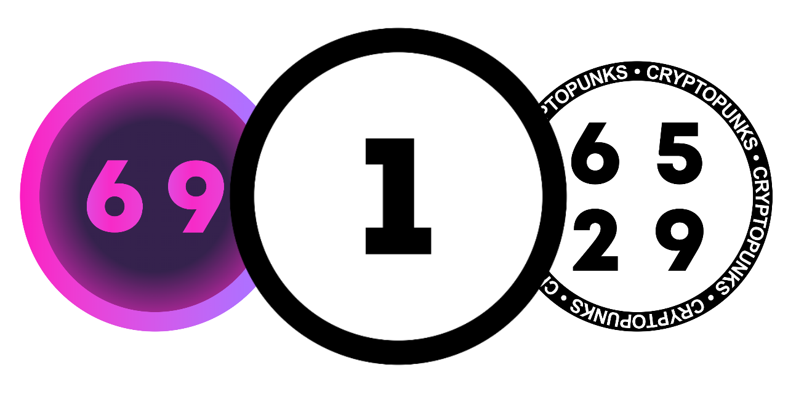
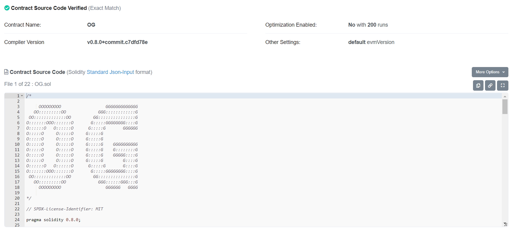

# OG by Tank



This repository contains the contracts, migration scripts and the minting website for [OG Official](https://opensea.io/collection/og-nft-official) & [OG Color Official](https://opensea.io/collection/ogcolor-nft-official).

Project & minting website is hosted free and anonymously on GitHub Pages: https://nfttank.github.io/OG/

## Recommended setup

- Visual Studio Code
  - Solidity Visual Developer Extension
- [Ganache](https://trufflesuite.com/ganache/)

## Getting started

This project uses [Truffle Suite](https://trufflesuite.com/) to compile, run and deploy smart contracts. To test things locally, you need to host a local Ethereum blockchain which is easy to do with [Ganache](https://trufflesuite.com/ganache/).

Install and run Ganache either by using their UI or by running the Ganache command line interface which is way faster:

```bash
# -p defines the port, Ganache is listening on
ganache-cli -p 7545
```

### Compiling

To compile the smart contracts simply run the following command once Ganache is up and running:

```bash
truffle compile
```

### Running tests

As you can't simply fix and patch your deployed contracts, it is highly recommended to aim for a high test coverage. Write as many meaningful tests as possible and run the following command once Ganache is up to make sure your contracts are behaving the way you want them to:

```bash

# run all tests
truffle test

# run tests of a certain test file
truffle test .\tests\OG.test.js
```

## Contract deployment

Once your contracts are ready, you can deploy them via `truffle migrate` on the Ethereum test networks or the mainnet.

```bash
truffle migrate --reset --network rinkeby
```

## Etherscan Verification

Once your contracts were deployed successfully, use Truffle once again to verify the source code. This is required to get the green checkmark on Etherscan, as most users won't interact with unverified smart contracts.

> Note that this action will make your smart contract source code visible to everyone.



This repository is set up to trigger a contract verification on Etherscan via Truffle.
Api keys and secrets have to be defined in the secrets.json file (ignored in this git repository).

```json
{
  "infuraProjectId": "...",
  "infuraProjectSecret": "...",
  "mnemonic": "one two three ... twelve",
  "etherscanApiKey": "..."
}
```
The wallet mnemonic can be created with https://iancoleman.io/bip39/ once and will be reused then. This wallet is the owner of the contract and will be able to run administrative `onlyOwner` methods.

> Make sure you keep your mnemonic (=seed phrase) secure.

The verification can be invoked by the following command:

```bash
# redeploy and verify
clear;
truffle migrate --reset --network rinkeby;
npx truffle run verify OG OGColor GotToken Digits Customizer --network rinkeby
```

More information:
 - https://forum.openzeppelin.com/t/how-to-verify-with-hardhat-or-truffle-a-smart-contract-using-openzeppelin-contracts/4119

# Website deployment

The project website is hosted on GitHub Pages.
Set up your own website with the following steps right out of your project's GitHub repository.

- Install Node
- Install yarn `npm install --global yarn`
- **Only once** Install gh-pages `yarn add gh-pages`
- **Only once** add homepage to package.json
```json
{
  "name": ...,
  "version": ...,
  "homepage": "https://nfttank.github.io/OG/",
  "dependencies": ...
```
- **Only once** add scripts predeploy and deploy to package.json
```json
  "scripts": {
    "start": ...,
    "predeploy": "npm run build",
    "deploy": "gh-pages -d build"
  }
```
- Run deployment with `npm run deploy`
- GitHub Pages have to point to the branch `gh-pages` (updated and pushed by this deployment)
